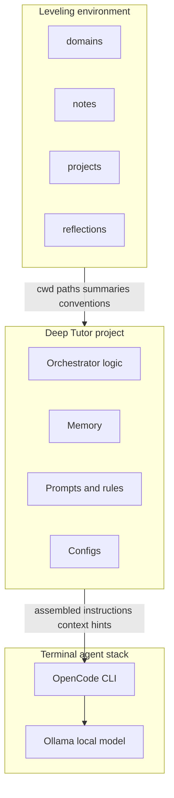
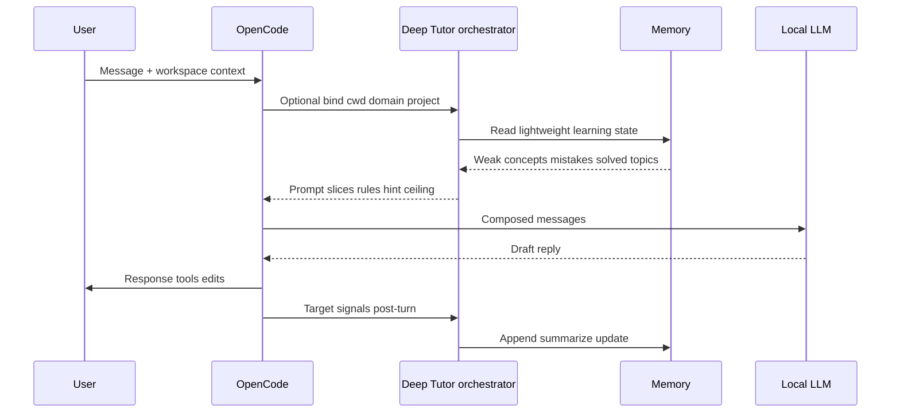
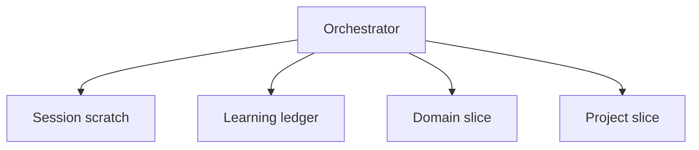

# Deep Tutor — system design

This document is the **canonical blueprint** for Deep Tutor as a **terminal-native developer intelligence layer**: orchestration, memory, and teaching rules that sit **above** your coding agent interface—not a separate chat product or backend-heavy platform.

**Related:** [Philosophy](../philosophy.md) · [README](../README.md) · [Usage model](USAGE_MODEL.md)

---

## Table of contents

1. [Positioning](#1-positioning)
2. [System flow](#2-system-flow)
3. [Two environments](#3-two-environments)
4. [Repository layouts](#4-repository-layouts)
5. [Terminal stack: OpenCode and Ollama](#5-terminal-stack-opencode-and-ollama)
6. [End-to-end architecture](#6-end-to-end-architecture)
7. [Request lifecycle](#7-request-lifecycle)
8. [Orchestrator](#8-orchestrator)
9. [Teaching behaviors and prompt modes](#9-teaching-behaviors-and-prompt-modes)
10. [Hint escalation](#10-hint-escalation)
11. [Memory system](#11-memory-system)
12. [Folder and domain context](#12-folder-and-domain-context)
13. [Prompting and guardrails](#13-prompting-and-guardrails)
14. [Evaluation](#14-evaluation)
15. [MVP vs future scope](#15-mvp-vs-future-scope)
16. [Development philosophy (Git, devlogs, experiments)](#16-development-philosophy-git-devlogs-experiments)
17. [Document control](#17-document-control)

---

## 1. Positioning

Deep Tutor is **a system designed to improve how developers think**. It is a **contextual learning system**: an orchestration and memory layer that shapes *how* questions get answered in the terminal—prioritizing reasoning, debugging discipline, and growth over throughput.

### What Deep Tutor is not

- A chatbot app or standalone AI UI  
- A separate assistant platform you “open instead of your editor”  
- A bulk code-generation tool or passive autocomplete layer  
- An “AI swarm” or fleet of autonomous agents you manage individually  

### What Deep Tutor is

- A **developer growth layer** embedded in your existing workflow  
- An **orchestration + memory system** that selects teaching posture, injects context, and applies rules  
- A **terminal-native mentor framework** aligned with **OpenCode** (or equivalent CLI agent) and **local inference** (typically **Ollama**)  
- An **adaptive intelligence layer** that integrates with the agent you already use rather than replacing your toolchain  

**Local-first** stays a hard preference: your prompts, rules, and learning artifacts remain under your control; the mental model is “policies and memory I run beside my agent,” not “opaque SaaS that learns from my keystrokes.”

**Repository reality:** at the time of writing, this repo is primarily **design and conventions**. Runtime pieces (orchestrator scripts, prompt packs, memory stores) are **targets** described here. Where behavior is specified but not implemented, this doc uses **Target behavior**.

---

## 2. System flow

The architecture is intentionally linear and boring:

```text
Leveling environment  →  Deep Tutor context layer  →  OpenCode CLI  →  Local LLM (Ollama)
```

| Stage | Role |
|-------|------|
| **Leveling environment** | *Where* you work and grow: domains, notes, projects, reflections. Supplies paths, artifacts, and intent. |
| **Deep Tutor context layer** | *How* the agent should teach: domain rules, memory slices, hint policy, prompt assembly. This repo. |
| **OpenCode CLI** | *Interface* you already use in the terminal: sessions, tools, file context, model calls. |
| **Local LLM (e.g. Qwen / DeepSeek via Ollama)** | *Inference*—cheap iteration, privacy, and explicit accountability for hallucinations. |

Deep Tutor does **not** need to own the wire protocol to the model for the MVP. It needs to own **policy**: what gets injected, what is forbidden at hint level *n*, and how folder context maps to teaching rules.



---

## 3. Two environments

Deep Tutor splits **software / pedagogy** from **personal growth workspace**. Mixing them blurs “what I ship” with “what I’m learning.”

### 3.1 Deep Tutor project (this repository)

The **engine**: orchestrator logic, prompts, memory implementation, domain configs, routing rules, scripts, and experiments **about** the teaching system itself.

You do **not** “open Deep Tutor instead of OpenCode.” You wire Deep Tutor **into** the session (generated preamble, included rules file, env pointing at configs, or a thin script—exact mechanism is an implementation choice; the **contract** is: orchestrator output → becomes part of what OpenCode sends to the model).

### 3.2 Leveling environment (`leveling-arc/`)

A **separate** workspace—recommended as a **sibling** to this repo:

```text
~/work/deep-tutor/       # intelligence layer (this repository)
~/work/leveling-arc/     # growth workspace
```

It holds long-horizon learning artifacts:

| Area | Purpose |
|------|---------|
| `domains/` | Study topology: e.g. `backend`, `dsa`, `system-design`, `databases`, `linux`, `ai-engineering`. |
| `projects/` | Application work: repos or subtrees where real constraints apply. |
| `notes/` | Durable explanations and links **you** curate. |
| `reflections/` | Short syntheses after sessions or milestones. |
| `devlogs/` | Honest narrative of attempts and failures. |
| `experiments/` | Bounded hypotheses with procedure and outcomes. |

**Domains vs projects (critical):**

- **Domains = learning** — drills, theory, weak concepts, interview-style practice.  
- **Projects = application** — tests, reviewers, production pressure.  

Example: `domains/dsa` holds notes and mistake patterns for algorithms; `projects/payments-api` is where backend skills face integration reality. Memory and prompts should treat **domain context** and **project context** separately even when topics overlap (e.g. hash tables in both).

**Target behavior:** a session resolves **filesystem context** (cwd or explicit path), derives a **domain key** when under `leveling-arc/domains/<name>/`, and optionally a **project key** when under `projects/…`, then loads the matching rule bundle and memory slice.

---

## 4. Repository layouts

### 4.1 Deep Tutor project (intent)

```text
deep-tutor/
├── prompts/           # System / mode templates, guardrails, hint wording
├── agents/            # Prompt-mode specs (mentor, debug, concept)—schemas + policies, not autonomous bots
├── orchestrator/      # Classification, routing, context binding, assembly (scripts or library—target)
├── memory/            # Lightweight stores, schemas, optional migrations
├── domains/           # Default domain rule packs (portable templates; optional overrides in leveling)
├── configs/           # Paths to leveling root, model profile hints, feature flags
├── scripts/           # CLI helpers: “print preamble for this cwd”, “append mistake”, etc.
├── experiments/       # Pedagogy and orchestration experiments
├── docs/              # Design docs (this file is canonical)
├── devlogs/           # Why the architecture changed
├── philosophy.md      # Values (repo root)
└── README.md
```

This repo is **not** primarily a backend application. It is primarily a **context system** and **learning orchestration** surface that cooperates with OpenCode.

### 4.2 Leveling environment (intent)

```text
leveling-arc/
├── domains/
│   ├── backend/
│   ├── dsa/
│   ├── system-design/
│   ├── databases/
│   ├── linux/
│   └── ai-engineering/
├── projects/
├── notes/
├── reflections/
├── devlogs/
├── experiments/
└── README.md          # Your conventions: naming, linking, how you invoke OpenCode here
```

---

## 5. Terminal stack: OpenCode and Ollama

**OpenCode** is the **terminal-native AI coding agent**: interactive session, tool use, file context, and model invocation in the environment where you already work. Deep Tutor assumes OpenCode (or a similar CLI agent) is the **user-facing runtime**, not a bespoke Deep Tutor UI.

**Ollama** (or equivalent) runs **local weights** (e.g. Qwen-class, DeepSeek-class). That keeps iteration cheap and aligns with “inspect everything” engineering discipline.

**Division of labor (conceptual):**

| Concern | Owned by |
|---------|-----------|
| Editing, grep, terminal tools, session UX | OpenCode |
| Model API, sampling, local inference | Ollama / provider adapter inside OpenCode |
| Teaching posture, domain rules, hint levels, memory injection | Deep Tutor |

**Target behavior:** the orchestrator produces **deterministic, inspectable artifacts**: e.g. a block of instructions + retrieved memory + domain rule table for the current cwd. Those artifacts are what you paste, include, or hook into OpenCode’s agent configuration—**without** turning Deep Tutor into a second chat application.

Exact wiring (project-level prompts, custom agents, wrapper scripts) will evolve; the architecture stays stable: **leveling supplies context; Deep Tutor supplies pedagogy; OpenCode supplies execution.**

---

## 6. End-to-end architecture



**Invariant:** the user does not pick “which AI agent” from a swarm. They work in OpenCode; Deep Tutor selects **prompt structure**, **memory**, **rules**, and **hint level**.

---

## 7. Request lifecycle

Phases are **logical**. In practice, OpenCode may batch steps; the orchestrator may be a **pre-step** or **post-step** script until fully integrated.

| Phase | Input | Output |
|-------|--------|--------|
| **Intake** | User message; session id; cwd; optional explicit domain/project | Normalized utterance; attachment metadata (snippet, trace) |
| **Context binding** | Path; leveling layout | Domain key, project key, tooling hints |
| **Signal extraction** | Utterance + attachments | Flags: `has_stack_trace`, `theory_question`, `partial_code`, etc. |
| **Memory read** | Keys from binding + session | Weak concepts, recent mistakes, frustration cues, solved markers |
| **Classification** | Signals + memory | Task type: debug / concept / guided work / meta |
| **Routing** | Classification + policies | **Teaching behavior** (prompt mode); optional secondary emphasis |
| **Hint policy** | Attempt counts; frustration estimate; prior hint level | Hint level `1–5` |
| **Prompt assembly** | Mode recipes + domain rules + memory + hint level | Final instruction bundle for OpenCode |
| **Generation** | OpenCode → LLM | Draft model output |
| **Guardrails** | Draft + policies | Shaped or blocked output |
| **Delivery** | Final text | User-visible response |
| **Memory write** | Signals; mode; hint level | Lightweight updates |

**Micro-example:** User pastes `IndexError` and two lines of code. **Signals:** stack trace + partial code. **Routing:** debug-oriented teaching behavior. **Memory:** repeated off-by-one pattern in `dsa`. **Hint level:** 2—name the pattern class without giving the patch. **Effect:** OpenCode’s reply asks for index ranges before the failing line.

---

## 8. Orchestrator

The orchestrator is still the **core brain**. It is **not** a spectacle orchestrator coordinating autonomous workers. It is a **policy engine**: decide how to teach this turn, given folder context and memory.

### 8.1 Responsibilities

- Detect **domain context** from paths (e.g. under `domains/dsa/` vs `domains/system-design/`).  
- Load **domain-specific rules** (what “good help” means here).  
- Select **teaching behavior** (prompt mode: mentor / debug / concept, etc.).  
- **Inject memory**: weak concepts, mistake fingerprints, recent frustration.  
- Enforce **learning philosophy** from `philosophy.md` and configs.  
- Apply **hint escalation** so convenience does not accidentally replace thinking.  

### 8.2 Default routing priorities

1. **Safety / scope** — Narrow or refuse unsafe instructions.  
2. **Hard debug signals** — Trace, fatal error, “why does this crash” → debug-oriented behavior.  
3. **Theory-first** — Definitions and comparisons without a failing run → concept-oriented behavior.  
4. **Guided work** — Stuck on approach without clear runtime failure → mentor-oriented behavior.  
5. **Tie-break** — Theory + failure together → address failure first; add concept only if clearly prerequisite.  

### 8.3 Domain rule examples (realistic)

These are **policy sketches** the orchestrator maps from folder context—not vague “be smart” directives.

**`domains/dsa/`**

- Avoid handing **full solutions** early; default is questions and constraints.  
- Emphasize **reasoning**: invariants, brute-force baseline, then optimization.  
- Encourage **try the naive approach first** when complexity is unclear—then refine.  
- Ask for **complexity and space/time tradeoffs** once a solution direction exists.  

**`domains/system-design/`**

- Surface **tradeoffs** (latency vs consistency, operational cost vs simplicity).  
- Encourage **architecture thinking**: boundaries, failure modes, evolution.  
- **Compare approaches** instead of declaring one winner without constraints.  
- Prioritize **reasoning quality** over faux-definitive “correct designs”—context matters.  

**`domains/backend/`** (illustrative)

- Tie answers to **observability** and **reproduction** when debugging services.  
- For APIs: status codes, idempotency, and failure semantics—not only happy paths.  
- When theory appears (“what is a race”), connect to **symptoms** you might see in logs.  

**`domains/databases/`** (illustrative)

- For query issues: **execution shape** and indexing reasoning before rewriting SQL.  
- For modeling: **access patterns** first; normalization discussion grounded in queries.  

### 8.4 Worked routing vignettes

**A — Wrong loop boundary, no traceback:** Mentor-oriented; hint 1–2; ask for invariant or termination.  

**B — `IndexError`:** Debug-oriented; inspect valid range and state; no full patch by default.  

**C — “What is a deadlock?” while cwd is `domains/backend`:** Concept-oriented; relate to locks and queues you’ve already touched per memory.  

**D — Service returns 500 with traceback:** Debug-oriented; optionally pull a thin concept clause if the trace exposes an unfamiliar ORM idea.

---

## 9. Teaching behaviors and prompt modes

**“Agents” in Deep Tutor are not autonomous AI systems.** At least for the MVP, they are **prompt modes**: packaged **reasoning styles** and **teaching behaviors** the orchestrator selects.

Examples:

- **Mentor mode** — guided problem solving; questions before answers.  
- **Debugging mode** — hypotheses, reproduction, narrowing, reading evidence.  
- **Concept explanation mode** — layered intuition → precision → minimal example.  

The orchestrator decides:

- Which **prompt structure** to use  
- What **memory** to inject  
- Which **rules** apply  
- What **hint ceiling** is in force  

### Mode summaries

**Mentor (default for ambiguity)** — Approach choice, partial implementations, reasoning gaps without a crisp error. Patient senior engineer; smaller subproblems.

**Debug** — Stack traces, failed assertions, wrong outputs under execution evidence. Teaches **habits**: reproduce, narrow, inspect state.

**Concept** — Mental models, comparisons, definitions. Not lengthy debugging threads unless failure forces it.

### Handoffs

| From | To | When |
|------|-----|------|
| Debug | Concept | Error symptom of primitive misunderstanding |
| Concept | Mentor | Moving from “what is it” to “how in my repo” |
| Mentor | Debug | Runtime evidence appears; speculation stops |

**Non-goals for MVP:** separate chatbots per mode; user-facing “call the Debug agent”; unsupervised tool policies disconnected from OpenCode’s own guardrails.

---

## 10. Hint escalation

Canonical scale **1–5**, unified across prompts and routing.

- **1–3:** Preserve thinking; add structure only as needed.  
- **4:** Partial scaffolding when struggle is real.  
- **5:** Full walkthrough when humane relief is needed, explicitly requested, or withholding no longer teaches.

### Levels (summary)

| Level | Objective |
|-------|-----------|
| **1** | Orient without giving away the key |
| **2** | Name the concept class |
| **3** | Structural steps / subgoals |
| **4** | Partial code / skeleton |
| **5** | Full explanation |

**Frustration cues** (repeated same mistake, many turns, emotional tone) **raise the floor** on hints; they do not automatically mean level 5 unless policy says so.

---

## 11. Memory system

Memory is **learning-focused**, **contextual**, and **lightweight**. **Simple and useful first** beats speculative semantic architectures.

### 11.1 MVP stance

Initially, memory can be **boring**:

- A few **markdown or JSON files** per domain or project, or a **single SQLite file** with a handful of tables—whatever you will actually maintain.  
- No requirement for embeddings, vector databases, or RAG pipelines to call the system “complete.”  

Track only what improves teaching:

- **Weak concepts**  
- **Repeated mistakes** (simple fingerprints, not perfect clustering)  
- **Solved topics** (so you do not re-drill unnecessarily)  
- **Frustration patterns** (session-level cues)  
- **Domain-specific struggles**  

### 11.2 Conceptual layers (still useful as you grow)



- **Session scratch** — Recent turns, current hypothesis, last hint level.  
- **Learning ledger** — Cross-cutting mistakes and mastery guesses—stay minimal until needed.  
- **Domain slice** — Per `domains/<id>` struggles and wins.  
- **Project slice** — Recurring defects and themes in application repos.  

### 11.3 Future (explicitly optional)

**Target behavior, not MVP:** richer relational schema, retrieval metrics, optional embeddings **you opt into** for notes. Deep Tutor should never **require** a distributed stack or “enterprise memory” to function.

### 11.4 Update triggers (examples)

- Increment mistake fingerprint on similar repeated errors.  
- Record independent success with low hints as positive evidence.  
- Log routing decisions in dev builds for offline review.

---

## 12. Folder and domain context

Folder context is the **primary sensor** for the MVP: cwd and path prefixes tell the orchestrator which rule bundle to load.

| Context signal | Typical inference |
|----------------|-------------------|
| Path under `leveling-arc/domains/<name>/` | Domain key = `<name>`; learning rules dominate |
| Path under `leveling-arc/projects/<app>/` | Project key; application constraints dominate |
| Path in unrelated repo | Generic rules + optional manual domain hint |

**Implementation realism:**

- Start with **explicit flags** (`--domain dsa`) when auto-detection is ambiguous.  
- Prefer **curated files** (domain `README`, `CONTEXT.md`) over ingesting every scratch file.  
- Never ingest secrets; redact paths in shared logs.

---

## 13. Prompting and guardrails

### Base posture (all modes)

- Teach through questions and constrained hints unless hint level permits more.  
- Prefer debugging steps and reasoning over code dumps.  
- Admit uncertainty; ask for missing code or traces.

### Refusals

- Demands for pure solution dumping → smallest next diagnostic step within hint policy.  
- Dangerous prod actions → refuse; propose safe alternatives.

### Privacy

- Default **local** inference; no silent cloud fallback unless you configure it.  

### Logging (evaluation hooks)

- Record: signals, teaching behavior used, hint level, latency, optional outcome tag.  
- Human spot-check transcripts where hint levels stayed high unusually long.

---

## 14. Evaluation

Separate **human judgment** from **automatable proxies**.

### Learning metrics (person-level)

- Rate of **repeated mistakes** (same fingerprint over time).  
- **Hint trajectory** for stable concept classes.  
- Fraction of work **finished with low-hint success** (honest self-report + logs).  

### Behavioral proxies

- Time to first **debug hypothesis** when in debug-oriented tasks.  
- Whether user **narrows** reproduction before asking for more hints.  
- Reflection / devlog throughput (quality judged lightly at first—presence beats polish).

### System proxies

- Routing agreement with a small hand-labeled set (offline).  
- p95 latency (hardware-dependent; not a proxy for learning).

### Example hypotheses (validate; do not worship)

- Repeated mistakes down meaningfully over weeks of serious use.  
- Average hint level drops ~1 step for concepts you practice deliberately.  

**Limits:** self-report bias, small samples. Metrics serve reflection—they do not replace judgment.

---

## 15. MVP vs future scope

### MVP (intentionally small)

The MVP is **deliberately narrow**:

- **OpenCode** (or equivalent CLI agent) as the interactive surface  
- **Local model via Ollama**  
- **Deep Tutor prompts and domain rules** checked into this repo  
- **Simple orchestrator logic**—even if it begins as documented conventions plus one script  
- **Lightweight memory**—files or minimal SQLite  
- **Folder / domain awareness** from cwd and leveling layout  

### Explicit non-goals for MVP

- Fully **autonomous AI agents** beyond OpenCode’s own agent loop  
- **Distributed systems** or microservices for teaching  
- **Complex vector memory** or mandatory RAG  
- **Enterprise** topology diagrams  
- Performance theater dashboards  

If an idea does not reduce confusion or improve thinking this month, **defer it**. Overengineering is a failure mode for a learning system: complexity steals attention from actual study.

### Progressive milestones (reference)

| Milestone | Deep Tutor repo | Leveling workspace |
|-----------|-----------------|---------------------|
| **MVP** | Prompt packs; domain rules; hint policy doc; minimal memory; optional “preamble” script | You maintain folders; conventions in README |
| **Routing v1** | Teach-mode selection + logging | Optional explicit domain/project flags |
| **Memory v1** | Slightly structured store; summaries | Curated notes referenced by path |
| **Integration** | Tighter hook with OpenCode agent config (implementation-specific) | Same |

---

## 16. Development philosophy (Git, devlogs, experiments)

Deep Tutor is a **serious engineering experiment** in learning systems—not a growth-hacked product narrative.

- **`deep-tutor/devlogs/`** — Why orchestration or prompts changed; dead ends recorded honestly.  
- **`leveling-arc/devlogs/`** — Learning narrative **separate** from engine changes.  
- **GitHub / commits** — Small units that explain **intent**; no cosmetic churn for vanity graphs.  
- **Experiments** — Time-boxed; negative results are successes (they bound the design space).  
- **Reflections** — Short synthesis after hard sessions; substance over voice.

Documentation exists to improve **reasoning** and **shipping discipline**, not audience metrics.

---

## 17. Document control

- **Canonical blueprint:** this file.  
- **Values:** [Philosophy](../philosophy.md).  
- **Entrypoint:** [README](../README.md).  
- **Workflows:** [Usage model](USAGE_MODEL.md).  
- **Topic stubs:** `docs/agents.md`, `docs/architecture.md`, `docs/memory.md`, `docs/evaluation.md`, `docs/roadmap.md`, `docs/prompts.md`, `docs/VISION.md` point here to reduce drift.
