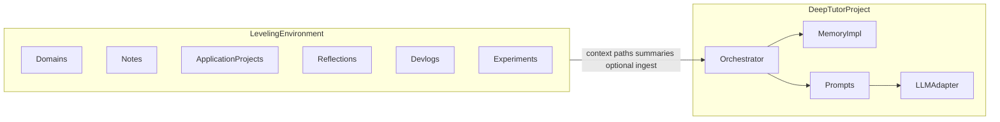
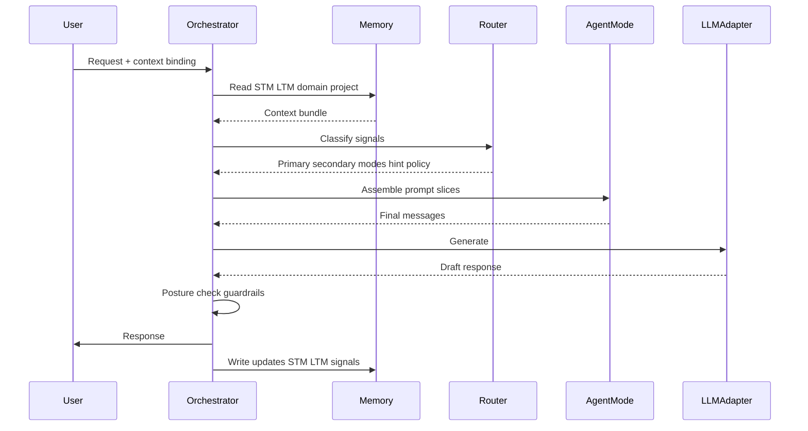
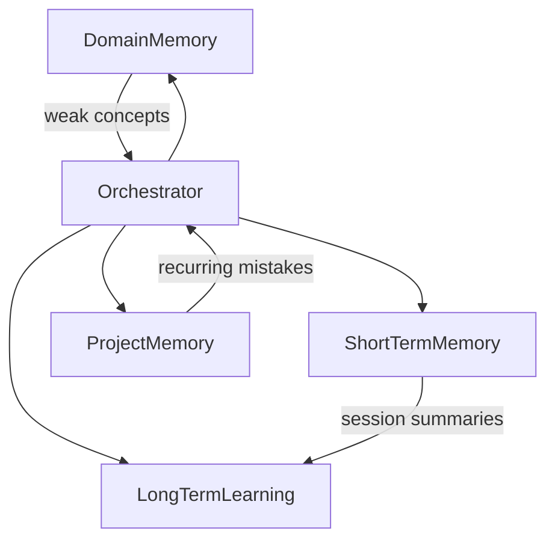

# Deep Tutor — system design

This document is the **canonical blueprint** for Deep Tutor as a local developer growth system. Older topical notes in `docs/*.md` are stubs that point here.

**Related:** [Philosophy](../philosophy.md) · [README](../README.md)

---

## Table of contents

1. [Positioning](#1-positioning)
2. [Two environments](#2-two-environments)
3. [Repository layout (intent)](#3-repository-layout-intent)
4. [End-to-end architecture](#4-end-to-end-architecture)
5. [Request lifecycle](#5-request-lifecycle)
6. [Orchestrator decision logic](#6-orchestrator-decision-logic)
7. [Agent system](#7-agent-system)
8. [Hint escalation](#8-hint-escalation)
9. [Memory system](#9-memory-system)
10. [Leveling environment design](#10-leveling-environment-design)
11. [Prompting and guardrails](#11-prompting-and-guardrails)
12. [Evaluation](#12-evaluation)
13. [MVP vs future scope](#13-mvp-vs-future-scope)
14. [Development philosophy (Git, devlogs, experiments)](#14-development-philosophy-git-devlogs-experiments)
15. [Usage and session model](#15-usage-and-session-model)
16. [Tech stack notes](#16-tech-stack-notes)

---

## 1. Positioning

Deep Tutor is a **local AI learning system** focused on how engineers think: debugging discipline, conceptual structure, and independence. It is intentionally **not** framed as a generic assistant product.

**Local-first** matters for this project for straightforward engineering reasons: your learning history and prompts stay under your control; latency and availability track your machine; the mental model is “tool I run,” not “service that trains on my questions.” Pedagogically, local operation also reinforces ownership—you are responsible for the workspace, the notes, and the veracity check on anything the model says.

**Current scope (this repository):** at the time of writing, the repo primarily holds **design documentation**; runtime components (orchestrator service, memory store, CLI) are **target** artifacts described below. Where behavior is specified but not yet implemented, this doc labels **Target behavior**.

---

## 2. Two environments

Deep Tutor deliberately splits **software** from **personal growth context**.



### 2.1 Deep Tutor project (engine)

The **Deep Tutor project** is the software you build and version here. It contains:

| Concern | Role |
|--------|------|
| Orchestrator | Single user-facing decision surface: intake, classification, memory IO, routing, hint policy, prompt assembly, post-response memory updates. |
| Agent modes | Specialized **reasoning stances** (not user-selectable chatbots). |
| Memory system | Persistence for short-term buffers and long-term learning/domain/project records. |
| Prompts | System and tool prompts enforcing teaching constraints. |
| Routing | Rules and tie-breaks mapping signals → primary (and optional secondary) mode. |
| APIs / CLI | Entrypoints for sessions (e.g. terminal-first). |
| LLM integration | Local inference (e.g. Ollama) behind a narrow adapter. |
| Evaluation hooks | Logging for routing, hint level, and outcomes for offline review. |

Users **do not** pick agents. They issue requests to the orchestrator only.

### 2.2 Leveling environment (personal developer OS)

The **leveling environment** is a **separate workspace**—recommended as a **sibling** directory to this repo, not nested inside it, e.g.:

```text
~/work/deep-tutor/          # engine (this repository)
~/work/leveling-arc/        # growth workspace (the other repository)
```

It holds long-horizon artifacts:

| Area | Purpose |
|------|---------|
| `domains/` | Study topology: e.g. `backend`, `dsa`, `databases`, `system-design`, `linux`, `ai-engineering`. |
| `notes/` | Durable explanations, links, worked examples **i** curate. |
| `projects/` | **Application** work: repos or subtrees where i ship or practice realistically. |
| `reflections/` | Short syntheses after sessions or milestones. |
| `devlogs/` | Narrative of attempts, failures, and lessons (honest, not performative). |
| `experiments/` | Bounded hypotheses with inputs, procedure, results, decision to keep or drop. |
| `README.md` | How **i** use this workspace; conventions for naming and linking. |

**Domains vs projects (critical):**

- **Domains = learning** — what i am studying, weak concepts, drills, theory.  
- **Projects = application** — where constraints are real (tests, reviewers, prod).  

Example: `domains/dsa` holds my study notes and mistake log for algorithms; `projects/payments-api` is where i apply backend and data modeling under production pressure. The orchestrator should treat domain memory and project memory **separately** even when content overlaps (e.g. “hash tables” appear in both).

**Target behavior:** sessions bind to a **filesystem context** (cwd or explicit path) and optionally to a **domain id** from the leveling layout; memory reads blend STM, long-term learning, domain slice, and project slice where IDs are known.

---

## 3. Repository layout (intent)

**Engine repo (`deep-tutor/`):**

```text
deep-tutor/
├── app/                 # HTTP/CLI entrypoints, session lifecycle
├── agents/              # Agent mode definitions (schemas, policies)
├── memory/              # Stores, migrations, retrieval
├── prompts/             # Prompt templates and constraints
├── docs/                # Design docs (this file is canonical)
├── devlogs/             # Engine-build narrative (optional)
├── experiments/         # Engine / pedagogy experiments (optional)
├── philosophy.md        # Values (repo root)
└── README.md
```

**Leveling workspace (`leveling-arc/`):**

```text
leveling-arc/
├── domains/
├── projects/
├── notes/
├── reflections/
├── devlogs/
├── experiments/
└── README.md
```

---

## 4. End-to-end architecture



**Invariant:** the user never branches the graph by “calling Debug.” The orchestrator chooses modes internally.

---

## 5. Request lifecycle

Phases are **logical**; implementation may batch or cache steps.

| Phase | Input | Output |
|-------|--------|--------|
| **Intake** | Raw user message; session id; cwd path; optional domain id | Normalized utterance; attachment metadata (code snippet, trace) |
| **Context binding** | Path; leveling config if present | Resolved **project root**, **domain key**, tooling hints |
| **Signal extraction** | Utterance + attachments | Flags: e.g. `has_stack_trace`, `theory_question`, `partial_code`, `explicit_explain_request` |
| **Memory read** | Keys from binding + session | STM window; LTM summary; domain memory slice; project memory slice |
| **Classification** | Signals + memory | Primary task type: debug / concept / guided implementation / meta |
| **Routing** | Classification + policies | Primary agent **mode**; optional secondary; handoff conditions |
| **Hint policy** | Attempt counts; frustration estimate; prior hint level; user request | Hint level `1–5`; caps and floors |
| **Prompt assembly** | Mode recipes + memory bundle + hint level | Message list for LLM |
| **Generation** | Messages | Draft model output |
| **Posture / guardrails** | Draft + policies | Revised or blocked output; refusal patterns |
| **Delivery** | Final text | User-visible response |
| **Memory write** | Signals; mode used; hint level; outcome guess | STM append; LTM / domain / project aggregates updated |

**Worked micro-example:** User sends a traceback and one line of code. **Signals:** `has_stack_trace=true`, `partial_code=true`. **Routing:** primary Debug mode. **Memory:** project memory shows repeated `NoneType` mistakes. **Hint level:** 2 (not first failure on this pattern). **Response style:** ask for variable state before the failing line, not the full fix.

---

## 6. Orchestrator decision logic

### 6.1 Default rules (priority order)

1. **Safety / scope** — Refuse or narrow unsafe instructions (credentials, destructive prod actions without guardrails).  
2. **Hard debug signals** — Stack trace, fatal error text, “why does this crash,” obvious runtime exceptions → **Debug** primary.  
3. **Theory-first** — “What is…”, “how does X work,” “difference between…” without a failing run → **Concept** primary.  
4. **Guided implementation** — Incomplete solution, algorithm confusion, “stuck on approach” without (2) → **Mentor** primary.  
5. **Tie-breaks** — If both theory and failure appear (“what is a promise” + broken async code), prefer **Debug** for the failure, with a short Concept clause only if misunderstanding is clearly primary.

### 6.2 Signal → routing table

| Signals (examples) | Primary mode | Secondary (optional) | Handoff trigger |
|-------------------|--------------|--------------------|-----------------|
| Trace, exception, wrong output under test | Debug | Concept | User lacks prerequisite concept for the error |
| Definition, mental model, compare/contrast | Concept | Mentor | User switches to coding task |
| Partial solution, design question, “how to approach” | Mentor | Concept | Repeated conceptual block |
| Explicit “explain step by step” after many failures | Mentor / Debug (context) | — | Escalate hint level per §8 |

Modes are **not** personas; they share memory and policy tables.

### 6.3 Worked routing examples

**A — Boundary error in loop (no traceback):**  
Signals: description of wrong iteration behavior, code snippet. **Primary:** Mentor. **Hint:** level 1–2; ask for invariant or stop condition.

**B — `IndexError: list index out of range`:**  
**Primary:** Debug. Response steers to valid index range and state before crash; no full patch by default.

**C — “What is a deadlock?” in domain `backend`:**  
**Primary:** Concept. Use domain memory to relate to queues/locks the learner already saw.

**D — Django view returns 500; traceback in message:**  
**Primary:** Debug. **Secondary:** Concept if traceback shows ORM misuse user has never seen. Project memory records ORM confusion pattern.

---

## 7. Agent system

Agent “profiles” are **specialized reasoning modes** selected by the orchestrator.

### 7.1 Mentor mode (default for ambiguous cases)

- **Intent:** Guide problem solving; ask questions; avoid handing full solutions early.  
- **Handles:** Approach choice, partial implementations, reasoning gaps without a crisp error.  
- **Does not own alone:** Deep stack trace triage; pure theory lectures.  
- **Style:** Patient senior engineer; pushes for hypotheses and smaller subproblems.

### 7.2 Debug mode

- **Intent:** Teach debugging **habits**: reproduce, narrow, read traces, inspect state.  
- **Handles:** Exceptions, failed assertions, unexpected outputs when execution evidence exists.  
- **Does not own alone:** Long conceptual primers without a concrete failure.  
- **Style:** “What did you expect / what happened?”; strategic breakpoints; isolate variables.

### 7.3 Concept mode

- **Intent:** Build mental models, analogies, and precise definitions.  
- **Handles:** “Why does this exist,” comparisons, foundational theory.  
- **Does not own alone:** Step-by-step debugging sessions.  
- **Style:** Clear layers: intuition → precise statement → small example.

### 7.4 Boundaries and handoffs

| From | To | When |
|------|-----|------|
| Debug | Concept | Error is a symptom of misunderstanding a primitive (e.g. async, pointer, complexity). |
| Concept | Mentor | Learner moves from “what is it” to “how do I apply it in my file.” |
| Mentor | Debug | Runtime evidence appears; speculation should stop and instrument. |

Handoffs can occur **within** a single response (short dual focus) or across turns.

### 7.5 Future modes (backlog, realistic)

| Mode | Role |
|------|------|
| DSA | Pattern vocabulary, invariants, complexity arguments—in service of problem solving, not cheatsheets. |
| Code review | Readability, test gaps, risk—**not** a linter replacement. |
| Reflection | Post-task review: what was hard, what to drill next. |
| Architecture | Boundaries, tradeoffs, evolution—high abstraction; must stay grounded in user context. |

**Non-goals:** autonomous subagents users address separately; “characters” with divergent policies; unsupervised tool use without orchestrator approval (**Target** for tool policy).

---

## 8. Hint escalation

Canonical scale **1–5** (unified across prompts and routing). Objectives:

- **1–3:** Preserve thinking; increase structure only as needed.  
- **4:** Partial implementation or near-complete scaffolding when struggle is real and time is burning.  
- **5:** Full explanation or walkthrough when **(a)** humane cap on frustration, **(b)** explicit reasoned request, or **(c)** withholding no longer teaches (e.g. pure typo after long arc).

### 8.1 Levels

| Level | Objective | Example stem | Advance when |
|-------|-----------|--------------|--------------|
| **1** | Orient without giving away the key | “What invariant does this loop maintain?” | User stalled or repeats wrong guess |
| **2** | Name the concept class without solving | “This looks like an off-by-one between stop index and length.” | Still stuck after applying level-2 once |
| **3** | Structural guidance (steps, subgoals) | “First isolate input size, then mid, then comparison branch.” | Multiple cycles; rising frustration |
| **4** | Partial code or skeleton | “Write the base case branch only; paste it here.” | Same mistake pattern ≥ N (policy) |
| **5** | Full explanation + walkthrough | Complete reasoning with code | Frustration threshold; explicit request; or low pedagogical value to withhold |

**Frustration indicators (examples):** repeated identical mistake, many turns on same subproblem, emotional language, session time unusually long for task class. These **raise floor** of hint level; they do not automatically mean “level 5” unless policy says so.

**Ethical / practical note:** Level 5 exists to **prevent learned helplessness** from turning into abandonment. It is not “failure of the method”—it is a pressure relief valve with logging so you can review whether classification or prerequisites were wrong.

---

## 9. Memory system

Memory supports **adaptive teaching** without pretending omniscience. Four conceptual layers:



### 9.1 Short-term memory (STM)

- Rolling transcript window; current task hypothesis; last hint level; open questions.  
- **Optimizes for:** coherence within the session.

### 9.2 Long-term learning memory (LTM)

- Cross-domain mistake fingerprints; frustration baselines; mastery estimates; spacing hooks (**Target**).  
- **Optimizes for:** person-level adaptation.

### 9.3 Domain memory

- Per `domains/<id>`: concept strength, drills done, theory gaps, vocabulary.  
- **Optimizes for:** curriculum shaped by **what** you study.

### 9.4 Project memory

- Per application repo: architecture notes, recurring defects, test flakiness themes, onboarding history.  
- **Optimizes for:** **where** you apply skill under real constraints.

**Note:** Older docs described “folder memory” for arbitrary cwd. That maps naturally to **project memory** when cwd is an application repo, and to **domain memory** when cwd is a study tree inside `leveling-arc/domains/`. The orchestrator should prefer explicit IDs over guessing.

### 9.5 SQLite-first schema (evolved)

**Target behavior.** Relational core before vector search.

| Table | Purpose |
|-------|---------|
| `users` | Single-user row or multi-tenant key; global prefs; frustration baseline. |
| `sessions` | `session_id`, `user_id`, `started_at`, `cwd_path`, `domain_key`, `project_key`, metadata. |
| `messages_stm` | Transcript chunks tied to `session_id` (or external blob store + FK). |
| `concepts_ltm` | `user_id`, `concept_id`, `mastery_score`, `attempts`, `successes`, `last_seen`. |
| `mistakes_ltm` | `user_id`, `fingerprint`, `count`, `last_seen`, `resolved`. |
| `domain_state` | `user_id`, `domain_key`, JSON or normalized weak concepts. |
| `project_state` | `user_id`, `project_key`, patterns, incidents. |
| `routing_log` | Classified signals, chosen mode, hint level, latency (**evaluation**). |

**Future:** embeddings + ANN (`Chroma`, `FAISS`, etc.) for notes and code snippets **you opt in**; never silent exfiltration.

### 9.6 Update triggers (examples)

- Increment mistake fingerprint on repeated similar errors.  
- Raise mastery after independent success with low hint level.  
- Bump frustration score intra-session; decay inter-session.  
- Write routing outcome for every turn in dev builds.

---

## 10. Leveling environment design

Treat `leveling-arc` as a **personal developer operating system**.

### 10.1 Domain-based learning

- Each domain folder has its own `README` or index: current focus, prerequisites, links to notes.  
- The orchestrator can ingest **summaries** you maintain (not every scratch file).  
**Target:** `--domain dsa` or auto-detect from cwd under `domains/`.

### 10.2 Long-term skill progression

- Periodic reflection files compare “what I thought I knew” vs evidence from projects.  
- Spaced repetition and drills (**Target**) draw from domain memory weak list.

### 10.3 Project-based application

- `projects/` entries point to real repos; project memory keys match those paths or stable slugs.  
- Issues and PRs are learning evidence; optionally log pointers, not secrets.

### 10.4 Experimentation workflow

- `experiments/YYYY-MM-short-name/` with `hypothesis.md`, `procedure.md`, `result.md`.  
- Failed experiments are valuable data—record why you stopped.

### 10.5 Reflective learning

- After heavy sessions, append to `reflections/` with: what was hard, what concept broke, next drill.  
- The Reflection agent mode (**future**) would prompt from these templates.

### 10.6 What feeds the orchestrator

| Source | Typically ingested? |
|--------|---------------------|
| Domain README / curated notes | Yes (summaries) |
| Raw scratchpads | Optional / user-triggered |
| Git history | Target (local stat only) |
| Secrets / credentials | Never |

---

## 11. Prompting and guardrails

### 11.1 Base posture

System prompt anchors (all modes):

- Teach through questions and constrained hints unless hint level permits more.  
- Prefer debugging steps and reasoning to code dumps.  
- Admit uncertainty; cite need to see code/trace when missing.

### 11.2 Refusals and redirects

- **“Just give me the answer”** → acknowledge goal; redirect to smallest next diagnostic or reasoning step; offer level increase only within policy.  
- **Credentials / prod danger** → refuse; propose safe alternative (rotate secret offline, use staging).  
- **Legal / licensing circumvention** → refuse.

### 11.3 Safety and privacy

- Default **local** inference; no silent cloud fallback unless explicitly configured.  
- Logs redact paths if shared externally (**Target** export tooling).  
- Teaching does not extend to enabling harm, fraud, or bypassing course integrity when stated as such—practical stance: focus on understanding, not on evasion.

### 11.4 Evaluation hooks

- Log: `signals`, `primary_mode`, `hint_level`, `latency_ms`, `session_id`, `outcome_tag` (user/partner label).  
- Enable **human spot checks** of transcripts where hint level stayed high for long stretches.

---

## 12. Evaluation

Separate **human judgment** from **automatable proxies**. Neither replaces the other.

### 12.1 Learning metrics (person-level)

- Rate of **repeated mistakes** (same fingerprint/week).  
- **Hint level trajectory** over sessions for the same concept class.  
- Fraction of tasks **solved independently** (self-report + low-hint wins).  
- **Mastery movement** on concept cards (simple 0–100 or ordered states).

### 12.2 Behavioral proxies

- Turns until first **debug hypothesis** (for Debug-tagged tasks).  
- Attempts before help requested (Mentor-tagged).  
- Reflection file completion rate (human-scored quality in early phases).

### 12.3 System metrics

- Routing accuracy vs hand-labeled set (**offline benchmark**).  
- Retrieval precision for memory slices (**Target**).  
- p95 latency local; tokens per turn (cost/heat—not a “success” metric).

### 12.4 Example targets (adjust to hardware + model class)

Illustrative thresholds from prior notes—treat as **hypotheses** to validate, not guarantees:

- Repeated mistakes down ≥20% over four weeks of active use.  
- Independent solves up ≥25% over four weeks (self-report + hint log).  
- Average hint level down ~1 step for stable concept classes.  
- Routing accuracy ≥85% on a small frozen eval set.  
- p95 ≤ ~4s for reference local setup (hardware-dependent).

### 12.5 Limits

Self-report bias; small sample sizes; domain transfer noise. Evaluation should be **honest**, iterative, and subordinate to human learning judgment.

---

## 13. MVP vs future scope

| Milestone | In-repo deliverables | Leveling workspace |
|-----------|----------------------|-------------------|
| **MVP** | Single entrypoint; **Mentor-only** mode live; minimal STM; hint levels 1–5 policy; local LLM adapter; basic logging | You maintain folders manually; optional path binding only |
| **M + routing** | Debug + Concept modes; classifier + tie-break rules; routing_log | Domain/project keys optionally passed explicitly |
| **Memory v1** | SQLite schema; LTM + domain + project tables; session summaries | Curated notes ingest **Target** |
| **Awareness** | Safe code lookup tools; project graph **Target** | Project memory auto snippets **Target** |
| **Adaptive** | Spaced drills; frustration model calibration; embeddings **Target** | Experiments drive which drills fire |

**Current scope:** design-first repo; treat rows above as a work breakdown, not shipped features.

---

## 14. Development philosophy (Git, devlogs, experiments)

- **Engine devlogs (`deep-tutor/devlogs/`):** why architectural choices changed; failed prototypes.  
- **Leveling devlogs (`leveling-arc/devlogs/`):** learning narrative separate from engine code.  
- **Commits:** explain intent; link issues or reflection ids when useful.  
- **Experiments:** time-box; record negative results.  

This stays **grounded**: documentation exists to support better engineering and learning, not audience growth metrics.

---

## 15. Usage and session model

**Target** interface: terminal-first session bound to a path, e.g.:

```bash
deep-tutor ~/projects/my-app
```

**Behavioral summary:**

1. Resolve **project root** and optional **domain** / **project** keys.  
2. Load STM + relevant LTM/domain/project rows.  
3. Enter loop: user message → lifecycle §5 → response.  
4. On exit, flush summaries into LTM and slice tables.

Folder archetypes (LeetCode vs Django vs ad-hoc scripts) influence **teaching emphasis** in prompts—not which user-facing “bot” talks.

---

## 16. Tech stack notes

**From prior design (still sensible defaults):**

| Layer | Choice |
|-------|--------|
| Service / orchestrator | Python + FastAPI (or CLI-first with same library core) |
| LLM | Local via Ollama; models such as Qwen-class weights |
| Memory | SQLite **first**; vector store **later** |

Exact names are implementation details; constraints matter more: **local default**, **testable routing**, **inspectable logs**.

---

## Document control

- **Canonical:** this file.  
- **Secondary:** [Philosophy](../philosophy.md), [README](../README.md).  
- **Archived topical stubs:** `docs/agents.md`, `docs/architecture.md`, etc. redirect here to prevent drift.
